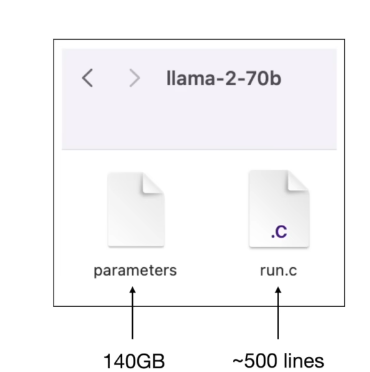
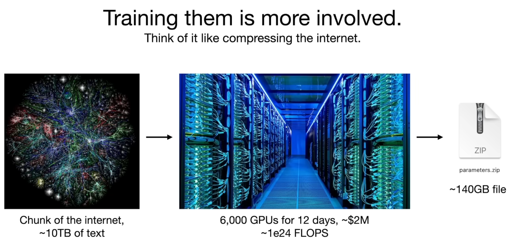
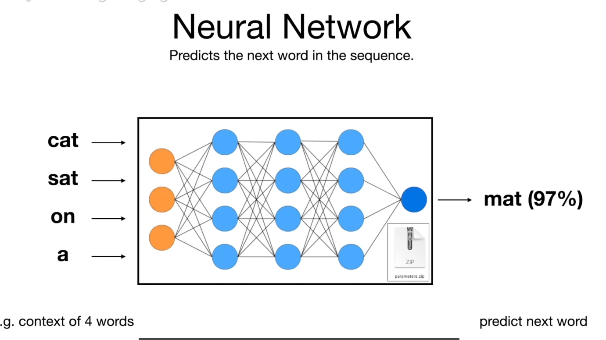
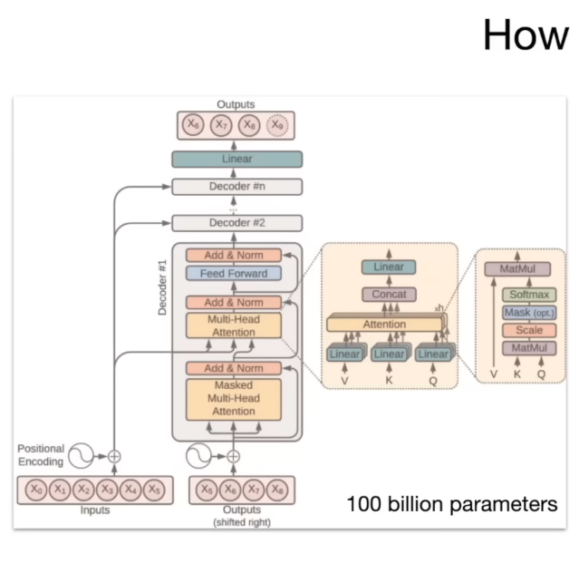
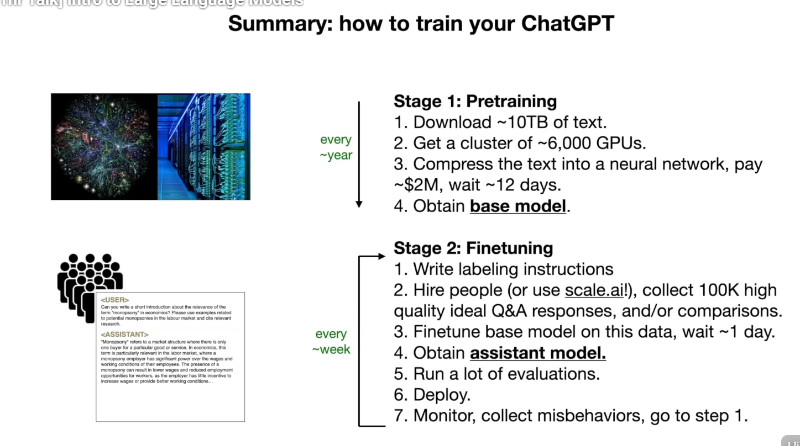
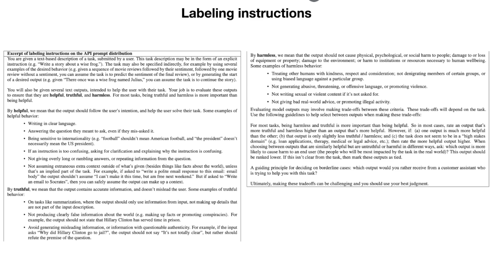
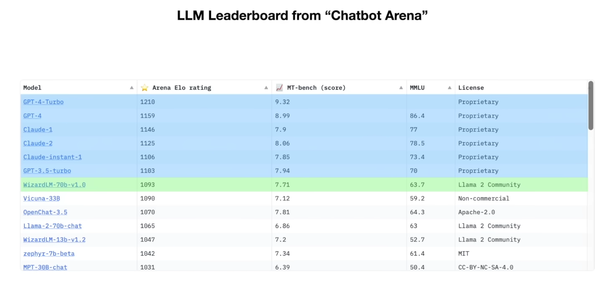
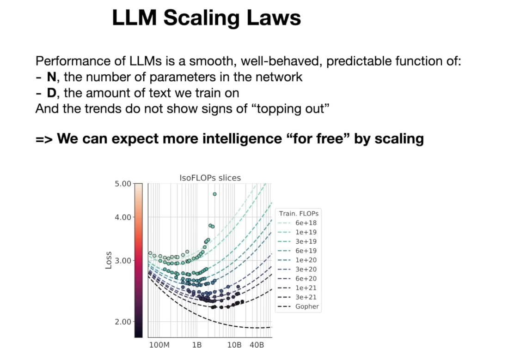
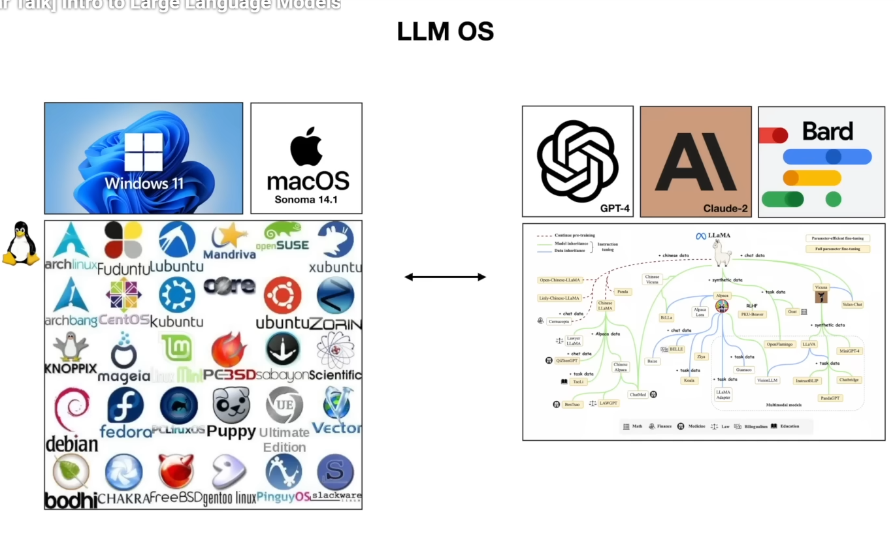

- a LLM Model is two files - parameters and code.
- parameters - it matrix of numbers, what model has learned, it is the "knowledge" of the model.
- code (run.c) - it is the "brain" of the model, it is the algorithm that takes the input and produces the output - transformers, attention, etc.
- magic is in the parameters, not in the code.
- code is the same for all models, parameters are different for each model.

### Training

- large chunk of internet data (10TB) -> GPU  -> parameters (matrix of numbers) -> LLM model (few GB).
- training is the process of adjusting the parameters (matrix of numbers) to minimize the loss function, which measures how well the model's predictions match the actual data.
- lossy compression - we are compressing 10TB of data into a few GB of parameters, so we are losing a lot of information, but we are keeping the most important information that allows the model to generalize and make predictions.
- the model learns to predict the next word in a sentence, given the previous words, by adjusting the parameters to minimize the loss function.
- cost - eg. llama 2 - 1.5B parameters, 1.5B tokens, 1 token = 4 bytes, so 6TB of data, training cost is around $100k.

### Neural Network

- predicts the next word in a sentence, given the previous words.
- input - a sequence of words (tokens) - "The cat is on the"
- output - the next word - "roof".
- the model learns to predict the next word by adjusting the parameters (matrix of numbers) to minimize the loss function, which measures how well the model's predictions match the actual data.
- the model is a function that takes the input (sequence of words) and produces the output (next word) by applying a series of transformations to the input, using the parameters (matrix of numbers) that it has learned during training.

### Fine tuning
- fine tuning is the process of taking a pre-trained model and adjusting the parameters (matrix of numbers) to perform a specific task, such as sentiment analysis, question answering, etc.
- fine tuning is much cheaper than training from scratch, because we are starting with a model that already has a lot of knowledge (parameters) and we are just adjusting it for a specific task.
- fine tuning can be done with a smaller dataset (eg. 100k tokens) and it can be done on a single GPU, which makes it accessible to more people and organizations.

### Self Chatgpt

- Not Stage 1 is expensive (due to GPU cost), but Stage 2 is cheap (due to fine tuning).
- Stage 1 is done by big companies, but Stage 2 can be done by anyone with a GPU and a small dataset.
- There is Stage 3 called Labeling, comparison instead of writing answers, we can compare the answers of different models and choose the best one, this is also cheap and can be done by anyone with a GPU and a small dataset.

## Performane
- 
- given from N & D, we can predict performance of upcoming models, we can see that the performance of LLMs is improving exponentially, and we can expect to see even more powerful models in the future.
- Training bigger models for longer time with more data is the key to improving performance, and we can expect to see models with trillions of parameters in the future, which will have even more knowledge and capabilities than current models.
- Hence, gold rush is on, everyone is trying to train bigger and better models, and we can expect to see a lot of innovation and competition in the field of LLMs in the coming years.

### RAG
- Retrieval Augmented Generation (RAG) is a technique that combines the power of LLMs with external knowledge sources, such as databases, search engines, etc.
- browsing with LLM.

### LLM OS

3 layers of LLM OS:
1. LLM - the core model that has learned a lot of knowledge from the training data.
2. RAG - the layer that allows the model to access external knowledge sources, such as
databases, search engines, etc.
3. Agents - the layer that allows the model to interact with the world, such as controlling a robot, playing a game, etc.
- LLM OS is the future of AI, it will allow us to create intelligent agents that can interact with the world in a more natural and intuitive way, and it will open up new possibilities for applications in various fields, such as healthcare, education, entertainment, etc.
- LLM OS will require a lot of research and development, but it has the potential to revolutionize the way we interact with technology and the world around us, and it will be an exciting area to watch in the coming years.