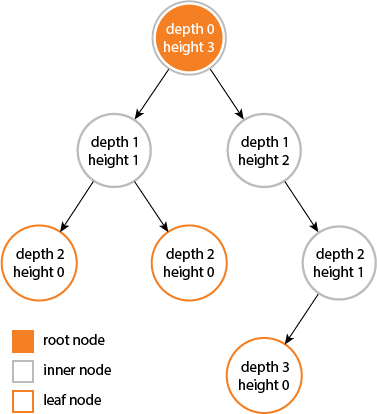

## Tree Fundamentals

### Depth (Root to Leaf)
- **Root node** → depth = 0
- **Each child** → depth = parent's depth + 1
- **Leaf node** → depth = maximum in its path
- **Tree depth** = depth of deepest node

### Height (Leaf to Root)
- **Leaf node** → height = 0
- **Each parent** → height = max(left height, right height) + 1
- **Root node** → height = height of tallest subtree
- **Tree height** = height of root node
- Height of tree = max depth of tree

### Diameter
- **Definition** → longest path between any two nodes
- **Formula** → for each node: left subtree height + right subtree height
- **Answer** → max diameter found across all nodes

Example:
```
      A
     / \
    B   C
   /
  D
```
- Depth of D = 2
- Height of B = 1
- Height of A = 2
- Diameter = 3 (path D → B → A → C)

