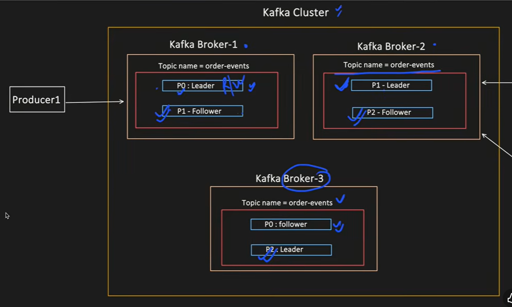
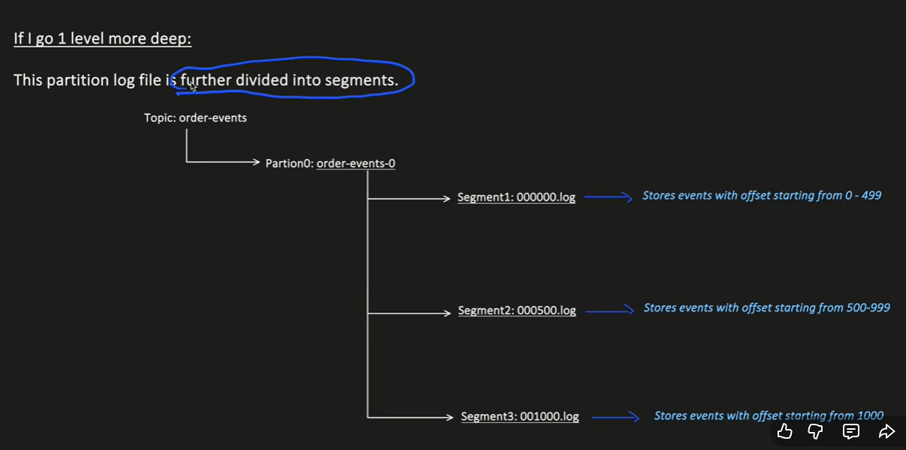
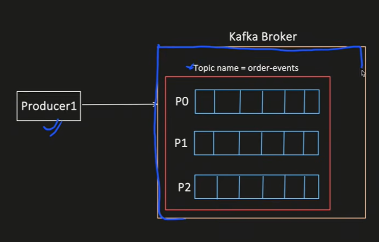
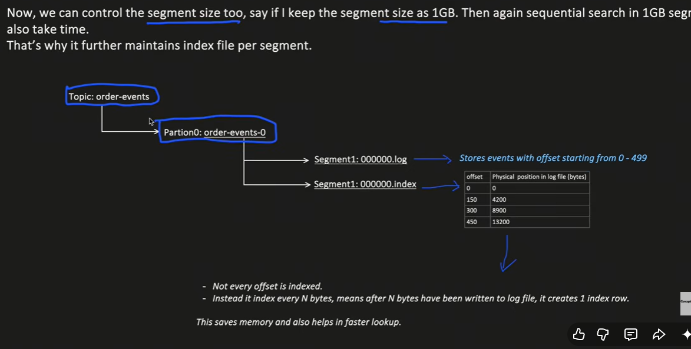
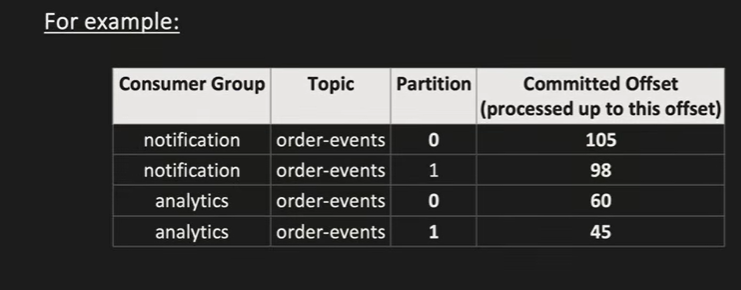

# RabbitMQ & Kafka vs RabbitMQ — Cheat Sheet

---

## RabbitMQ

### What is RabbitMQ?
Message broker — routes messages between services via exchanges and queues.

### Core Concepts

```
Producer → Exchange → Queue → Consumer
```

| Concept | Description |
|---------|-------------|
| Exchange | Receives messages from producer, routes to queues |
| Queue | Stores messages until consumed |
| Binding | Rule connecting exchange to queue |
| Routing Key | Label on message used for routing |

### Exchange Types

| Type | Routing | Use case |
|------|---------|----------|
| **Fanout** | Broadcasts to ALL bound queues | One event → multiple services |
| **Direct** | Routes by exact routing key | Specific service routing |
| **Topic** | Routes by pattern (`payment.*`) | Flexible routing |
| **Headers** | Routes by message headers | Complex routing rules |

---

### Your Scenario — Reservation Events

When a reservation was created, updated, or deleted — Down Payment Invoice Service and Payment Invoice Service both needed to react.

**Fanout Exchange** — one event broadcast to both queues simultaneously.

```
Reservation Service
    ↓ INSERT / UPDATE / DELETE
Fanout Exchange (reservation.events)
    ↓                    ↓
down-payment-queue    payment-invoice-queue
    ↓                    ↓
Down Payment          Payment Invoice
Invoice Service       Service
```

### Config
```java
@Configuration
public class RabbitMQConfig {

    @Bean
    public FanoutExchange reservationExchange() {
        return new FanoutExchange("reservation.events");
    }

    @Bean
    public Queue downPaymentInvoiceQueue() {
        return new Queue("down-payment-invoice-queue", true); // durable
    }

    @Bean
    public Queue paymentInvoiceQueue() {
        return new Queue("payment-invoice-queue", true);
    }

    @Bean
    public Binding downPaymentBinding() {
        return BindingBuilder.bind(downPaymentInvoiceQueue()).to(reservationExchange());
    }

    @Bean
    public Binding paymentInvoiceBinding() {
        return BindingBuilder.bind(paymentInvoiceQueue()).to(reservationExchange());
    }
}
```

### Publisher
```java
@Service
@RequiredArgsConstructor
public class ReservationEventPublisher {

    private final RabbitTemplate rabbitTemplate;
    private static final String EXCHANGE = "reservation.events";

    public void publish(Reservation reservation, String eventType) {
        ReservationEvent event = ReservationEvent.builder()
            .reservationId(reservation.getId())
            .eventType(eventType)  // CREATED, UPDATED, DELETED
            .reservation(reservation)
            .occurredAt(LocalDateTime.now())
            .build();

        rabbitTemplate.convertAndSend(EXCHANGE, "", event); // routing key ignored for fanout
    }
}
```

### Consumer
```java
@Component
public class DownPaymentInvoiceConsumer {

    @RabbitListener(queues = "down-payment-invoice-queue")
    public void handle(ReservationEvent event) {
        switch (event.getEventType()) {
            case "CREATED" -> downPaymentInvoiceService.create(event.getReservation());
            case "UPDATED" -> downPaymentInvoiceService.update(event.getReservation());
            case "DELETED" -> downPaymentInvoiceService.delete(event.getReservationId());
        }
    }
}
```

### Interview Answer
> "We used RabbitMQ with a Fanout Exchange for reservation lifecycle events. When a reservation was created, updated, or deleted, one event was published to the exchange. RabbitMQ broadcast it to two queues — Down Payment Invoice Service and Payment Invoice Service — each processed independently to manage their respective invoices. Fanout was the right exchange type since both services needed every event regardless of type."

---

## Kafka vs RabbitMQ

| | Kafka | RabbitMQ |
|--|-------|----------|
| Pattern | Event streaming (pull) | Message queue (push) |
| Message retention | Configurable (days/forever) | Deleted after consumed |
| Replay | Yes — rewind offset | No |
| Throughput | Very high (millions/sec) | Medium-high |
| Routing | Topic + partition key only | Flexible (exchanges, routing keys) |
| Consumer model | Pull — consumer reads at own pace | Push — broker pushes to consumer |
| Ordering | Per partition | Per queue |
| Use case | Event sourcing, audit, streaming | Task queue, RPC, routing |
| Complexity | High | Medium |
| Replay on crash | Yes | No (message lost if not acked) |

### When to use Kafka
- High throughput event streaming
- Need to replay events (audit, reprocessing)
- Multiple independent consumer groups
- Event sourcing — state from event history
- Financial audit trail

### When to use RabbitMQ
- Task queue — one message, one consumer
- Flexible routing by type/key
- Request/Reply (RPC) pattern
- Lower volume, simpler setup
- Push-based notification

### Your scenario mapped
| Scenario | Choice | Why |
|----------|--------|-----|
| Reservation → Invoice | RabbitMQ Fanout | Simple broadcast, no replay needed |
| Payment processing | Kafka | High volume, audit trail, replay |
| Report generation trigger | RabbitMQ | Task queue, one consumer |
| Settlement event stream | Kafka | Multiple consumers, retention needed |

### Interview Answer
> "We used both in different contexts. RabbitMQ for reservation lifecycle events — simple fanout to invoice services, no replay needed, lower volume. Kafka would be the choice for payment event streaming where we need audit trail, replay capability, and multiple independent consumer groups processing at scale. The key distinction is — RabbitMQ is a message broker optimized for routing and task queues, Kafka is an event streaming platform optimized for high throughput and persistence."


---

@Kafka

What?
- Distributed event streaming platform
- Streaming means stored events that can be replayed
Why use?
- Publish events.
- Store events for long-term.
- Subscribe to events with multiple independent consumers.

- Producer → Topic → Partition → Partition log -> Segment → Consumer Group → Consumer

@ Producer
- Publishes events to a topic.
-Does not care who consumes or how many consumers there are.

@Topic
- Folder for events.
- Has multiple partitions.

@Partition
- Ordered log of events.
- Multiple partitions in each topic for scalability.
- Each partition guarantees order of events, but not across partitions.
- Different consumers from diff consumer can read same partitions, but one consumer group - only consumer per partition.
- Each partition - has replication factor, i.e. no of partition copies in one broker.
- One leader, multiple followers.
- If leader goes down, one follower becomes leader.
- Followers across brokers for fault tolerance.
- Leader responsible - Handle producer/consumer req, maintain partition log, coordinate replication with followers.
- Followers - stay sync with leader, replicate partition log, take over if leader fails, Never handle producer/consumer req.**



@Segment
- Partition is split into segments for storage.
- Old segments can be deleted based on retention policy.
- Have name as per size eg. 500-1000 means segment contains events with offsets 500 to 999. Name is 00000500-00000999.
- If consumer wants to read offset 650, it will read from segment 500-1000 and skip to offset 650.

@Partition log
- Append-only log of events for a partition.
- Consumers read from this log at their own pace.



@Consumer Group
- Group of consumer that read from a topic.
- One partition = one consumer in the group (for load balancing).
- Multiple consumer groups can read the same topic independently.
- Group of microservice instances = one consumer group.

@Consumer
- Reads events from a topic.
- One microservice instance = one consumer.

@Broker
- Single Kafka server instance.
- Stores some topics and some partitions of the topics. (Not all, they are distributed across brokers). If one broker goes down, others can take over its partitions.
- Handles producer and consumer requests.
- Multiple brokers form a Kafka cluster for scalability and fault tolerance.


@Kafka cluster
- group of brokers working together.

Other info


@Index file per segment
- Offset position in segment - index file eg. 500-1000 segment has index file with entries like:
```
Offset 500 → position 0
Offset 550 → position 50
Offset 600 → position 100
```
- Consumer want 550 - checks index file, goes to position 50 in segment file and starts reading.
- Helps in fast lookup of offsets without scanning entire segment.




@Scenarios
- Reservation created → publish to reservation topic → multiple consumer groups (down payment invoice, payment invoice, notification service) consume independently.

1. Consumer > Partitions
- Consumer A - partition 0
- Consumer B - partition 1
- Partition 2 - IDLE (one consumer free, can be assigned to partition 2 for load balancing)

2. Consumer < Partitions
- Consumer A - partition 0, 1
- Consumer B - partition 2
- Consumer A handles more load, but can process multiple partitions if needed.
- Consumer B handles less load, but can focus on one partition.

3. Consumer = Partitions
- Consumer A - partition 0
- Consumer B - partition 1
- Consumer C - partition 2
- Perfect load balancing, each consumer handles one partition.

@Scenario
- If multiple consumers in diff consumer group want to read same events, what happens to offset?
- Each consumer group maintains its own offset for each partition.
- Consumer group (notification-service)
  - Consumer A - partition 0, offset 100
- Consumer group (down-payment-invoice-service)
  - Consumer B - partition 0, offset 150
- Same partition, different consumer groups, independent offsets.



─────────────────────────────────────────
GRADLE DEPENDENCIES
─────────────────────────────────────────

// build.gradle (Groovy DSL)
// Spring Boot + Spring Cloud BOM

plugins {
    id 'org.springframework.boot' version '3.3.2'
    id 'io.spring.dependency-management' version '1.1.6'
    id 'java'
}

dependencyManagement {
    imports {
        mavenBom "org.springframework.cloud:spring-cloud-dependencies:2023.0.3"
    }
}

dependencies {

    // ── RabbitMQ ────────────────────────────────────────────────────────────
    // Core AMQP starter — RabbitTemplate, @RabbitListener, auto-config
    implementation 'org.springframework.boot:spring-boot-starter-amqp'

    // Test support (embedded RabbitMQ via testcontainers)
    testImplementation 'org.springframework.amqp:spring-rabbit-test'

    // ── Kafka ────────────────────────────────────────────────────────────────
    // KafkaTemplate, @KafkaListener, consumer/producer auto-config
    implementation 'org.springframework.kafka:spring-kafka'

    // Test support (embedded Kafka broker in unit tests)
    testImplementation 'org.springframework.kafka:spring-kafka-test'

    // ── Spring Cloud Bus (optional — auto-refresh config across services) ────
    // With RabbitMQ as the bus transport
    implementation 'org.springframework.cloud:spring-cloud-starter-bus-amqp'
    // With Kafka as the bus transport (pick one, not both)
    // implementation 'org.springframework.cloud:spring-cloud-starter-bus-kafka'

    // ── Actuator (required for /actuator/busrefresh endpoint) ────────────────
    implementation 'org.springframework.boot:spring-boot-starter-actuator'
}

// ── application.yml config snippets ─────────────────────────────────────────
//
// RabbitMQ connection:
//   spring.rabbitmq.host=localhost
//   spring.rabbitmq.port=5672
//   spring.rabbitmq.username=guest
//   spring.rabbitmq.password=guest
//
// Kafka connection:
//   spring.kafka.bootstrap-servers=localhost:9092
//   spring.kafka.consumer.group-id=my-group
//   spring.kafka.consumer.auto-offset-reset=earliest
//   spring.kafka.consumer.key-deserializer=org.apache.kafka.common.serialization.StringDeserializer
//   spring.kafka.consumer.value-deserializer=org.apache.kafka.common.serialization.StringDeserializer
//   spring.kafka.producer.key-serializer=org.apache.kafka.common.serialization.StringSerializer
//   spring.kafka.producer.value-serializer=org.apache.kafka.common.serialization.StringSerializer

─────────────────────────────────────────

@Offset commits
- What? 
- Consumer commits offset after read.
- Why?
- To track progress and ensure at-least-once delivery.
- How?
- Auto commit: Kafka automatically commits offsets at intervals (5 seconds by default). Pro: Simple to implement. Con: If consumer crashes before commit, some events may be reprocessed. 
eg. consumer reads till offset 100, crashes before commit. On restart, it will read from offset 95 (last committed offset) and reprocess events 95-100.
why reprocess? becauase offset 95 was last committed, so Kafka assumes consumer has processed up to 95. Events 96-100 are uncommitted, so they will be reprocessed on restart.

- Manual commit: Consumer explicitly commits offsets after processing events. Pro: More control, can ensure events are processed before commit. Con: More complex, need to handle commit logic.
```java
// Auto commit example
props.put(ConsumerConfig.ENABLE_AUTO_COMMIT_CONFIG, "true");
props.put(ConsumerConfig.AUTO_COMMIT_INTERVAL_MS_CONFIG, "5000");
// Manual commit example
props.put(ConsumerConfig.ENABLE_AUTO_COMMIT_CONFIG, "false");
// After processing events
consumer.commitSync();
```

